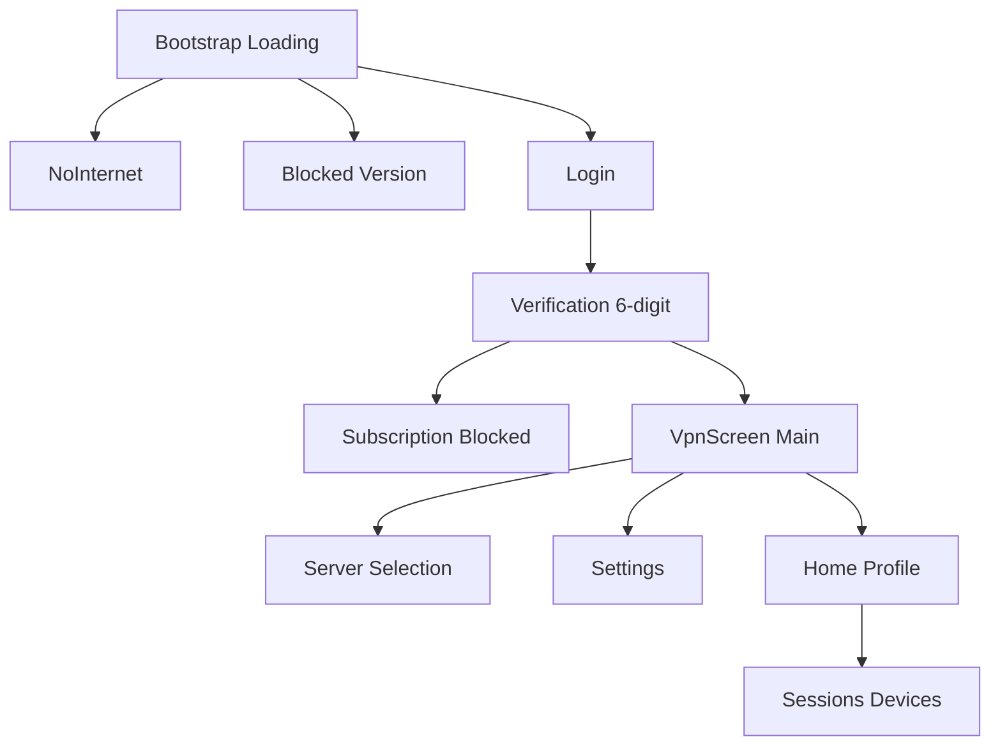
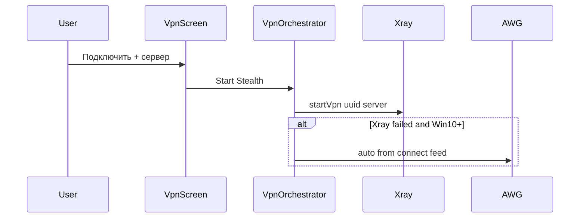

# Перенос UI Flutter → WPF v2

## Почему сейчас «не тот» интерфейс

На скриншоте — **наша временная заглушка**, а не Flutter:

| Сейчас в v2 (неверно) | Во Flutter ([`vpn_screen.dart`](S:\vpn_sc\lib\screens\vpn_screen.dart)) |
|----------------------|------------------------------------------------------------------------|
| Градиент на всех экранах | Градиент только на auth/ошибках; **главный VPN — белый фон** |
| ComboBox «Xray / AWG» | **Нет** выбора протокола на главном экране |
| ComboBox серверов | Кнопка с **флагом** → отдельный экран [`server_selection_screen.dart`](S:\vpn_sc\lib\screens\server_selection_screen.dart) |
| Одна кнопка «Подключить/Отключить» | **Две** кнопки: Подключить + Отключить |
| Футер: Сессии / Настройки / Выйти | **AppBar**: иконки Настройки, Профиль, Выход |
| Поле `vpn://` в настройках | **Нет** — протокол «Stealth» только для отображения |

Протокол **Stealth** во Flutter = Xray/VLESS (системный прокси). AWG в v2 — **внутренняя** логика Win10+ (резерв), не отдельный пункт UI.

---

## Карта экранов Flutter → WPF

### 1. Loading — [`main.dart` AuthCheckScreen](S:\vpn_sc\lib\main.dart)
- Градиент `#1E3C72 → #3B82F6`, спиннер, «Загрузка...»
- **v2:** уже есть `AppPage.Loading` — ок

### 2. No Internet — [`no_internet_screen.dart`](S:\vpn_sc\lib\screens\no_internet_screen.dart)
- Градиент, заголовок, текст, «Попробовать снова»
- **v2:** есть `AppPage.NoInternet` — дополнить текстами из [`ru.json`](S:\vpn_sc\assets\translations\ru.json)

### 3. Blocked version — [`blocked_screen.dart`](S:\vpn_sc\lib\screens\blocked_screen.dart)
- Сообщение + кнопка «Обновить приложение»
- **v2:** есть `AppPage.Blocked` — **добавить кнопку обновления** (`AutoUpdateService`)

### 4. Login — [`login_screen.dart`](S:\vpn_sc\lib\screens\login_screen.dart)
- Градиент + **белая карточка**: логотип shield, «VPN-SC», tagline, email, «Получить код»
- **v2:** упростить — только TextBox на градиенте; **нужна карточка и логотип**

### 5. Verification — [`verification_screen.dart`](S:\vpn_sc\lib\screens\verification_screen.dart)
- 6-значный код, таймер повторной отправки, «Изменить e-mail»
- **v2:** есть код; **добавить resend timer + change email**

### 6. Subscription blocked — [`subscription_blocked_screen.dart`](S:\vpn_sc\lib\screens\subscription_blocked_screen.dart)
- «Оформить подписку» (url), «Проверить подписку», выход
- **v2:** только текст + logout — **добавить кнопки подписки**

### 7. Main VPN — [`vpn_screen.dart`](S:\vpn_sc\lib\screens\vpn_screen.dart) — **главный экран**
Структура:
- **AppBar** `#3B82F6`: заголовок, ⚙ Settings, 👤 Profile, 🚪 Logout
- **Body белый:**
  - Статус: круг + «Подключено»/«Отключено» + имя сервера
  - «Выберите сервер» → кликабельный ряд с флагом (открывает ServerSelection)
  - Кнопки **Подключить** (синяя) и **Отключить** (красная), side-by-side
  - При подключении: карточка «Трафик зашифрован», таймер `MM:SS`, статистика ↑↓ внизу
- **Убрать:** Protocol Xray/AWG, футер-кнопки, градиент на Main

### 8. Server selection — [`server_selection_screen.dart`](S:\vpn_sc\lib\screens\server_selection_screen.dart)
- Список серверов с **флагами** ([`flag_service.dart`](S:\vpn_sc\lib\services\flag_service.dart)), названием страны
- «Smart Location» / «Автоматический выбор» с бейджем «Рекомендуется»
- **v2:** заменить ComboBox на `ServerSelectionWindow` + порт `FlagService`

### 9. Settings — [`settings_screen.dart`](S:\vpn_sc\lib\screens\settings_screen.dart)
- Автозапуск (Switch)
- Протокол **Stealth** — только текст (не ComboBox)
- Язык RU/EN
- Баннер обновления + диалог changelog
- Карточка «Информация»: версия, протокол, автозапуск
- **Убрать:** поле `vpn://`, кнопку загрузки xray (оставить только если есть во v1 WPF — во Flutter её нет)

### 10. Profile — [`home_screen.dart`](S:\vpn_sc\lib\screens\home_screen.dart)
- Email, verified, дни подписки, кнопка «Управление устройствами» → Sessions
- **v2:** нет — **создать `ProfileWindow`**

### 11. Sessions — [`sessions_screen.dart`](S:\vpn_sc\lib\screens\sessions_screen.dart)
- Список устройств, terminate, даты
- **v2:** есть [`SessionsWindow`](s:\vpn_sc_v2\VpnSc\Windows\SessionsWindow.xaml) — **доработать UI под Flutter**

---

## Логика подключения (без лишнего UI)

- UI всегда показывает **Stealth** (как Flutter)
- **Удалить** из [`MainViewModel`](s:\vpn_sc_v2\VpnSc\ViewModels\MainViewModel.cs): `ProtocolOptions`, `SelectedProtocol`, `ShowAwgProtocol`
- **Удалить** из [`SettingsWindow`](s:\vpn_sc_v2\VpnSc\Windows\SettingsWindow.xaml): `AwgPanel`, `awg_vpn_uri` storage
- **Расширить** [`VpnOrchestrator`](s:\vpn_sc_v2\VpnSc\Services\VpnOrchestrator.cs): Xray → при ошибке AWG (Win10+), парсить `vpn://` из того же `connect.vpn-sc.com` feed (если есть)

---

## Файлы для изменения

| Действие | Файлы |
|----------|-------|
| Главный экран Flutter-layout | [`MainWindow.xaml`](s:\vpn_sc_v2\VpnSc\MainWindow.xaml), [`MainViewModel.cs`](s:\vpn_sc_v2\VpnSc\ViewModels\MainViewModel.cs) |
| Новые Views | `Views/LoginView.xaml`, `VerifyView.xaml`, `VpnMainView.xaml`, … или UserControls |
| Server picker + флаги | `Windows/ServerSelectionWindow.xaml`, `Services/FlagService.cs` |
| Profile | `Windows/ProfileWindow.xaml` |
| i18n | [`I18n.cs`](s:\vpn_sc_v2\VpnSc\Localization\I18n.cs) — ключи из [`ru.json`](S:\vpn_sc\assets\translations\ru.json) |
| Стили | [`VpnBranding.xaml`](s:\vpn_sc_v2\VpnSc\Themes\VpnBranding.xaml) — белая тема Main, синий AppBar |
| Убрать AWG UI | Settings, MainViewModel, StorageService `awg_vpn_uri` |

---

## Порядок работ

1. **Убрать** ошибочный UI (протокол Xray/AWG, vpn://)
2. **Пересобрать Main VPN** под Flutter (белый body, AppBar, 2 кнопки, статус)
3. **ServerSelectionWindow** + FlagService
4. **Login / Verify** — карточки и тексты как во Flutter
5. **Settings / Profile / Sessions / SubBlocked / Blocked** — довести до паритета
6. **VpnOrchestrator** — автоматический резерв AWG без UI

---

## Win7 vs Win10+

- Win7: только Stealth (Xray), без AWG в orchestrator
- Win10+: Stealth в UI; AWG только как скрытый fallback
