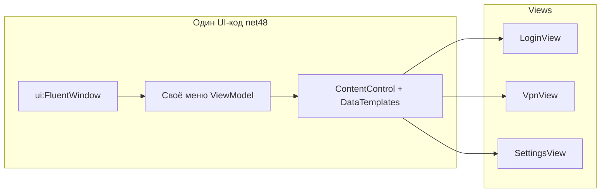
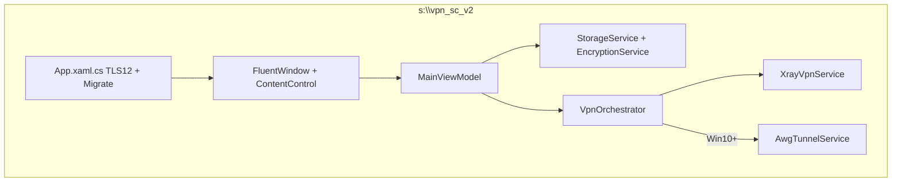

# Единая платформа: WPF + Wpf.Ui (только `s:\vpn_sc_v2`)

## Жёсткое правило

| Каталог | Действие |
|---------|----------|
| **`s:\vpn_sc_v2`** | Все изменения |
| `S:\vpn_sc`, `D:\awg` | Только чтение / копирование |

---

## Что значит «POC навигации / fallback» — простым языком

**Wpf.Ui состоит из двух частей:**

| Часть | Что делает | На .NET 4.8 |
|-------|------------|-------------|
| **Визуал** | `FluentWindow`, кнопки, поля, иконки, тёмная тема, Snackbar | Работает стабильно |
| **Навигация** | `NavigationView` + встроенный `Frame` (переключение страниц как в браузере) | На net48 **иногда ломается** ([issue #1352](https://github.com/lepoco/wpfui/issues/1352)) |

Примеры в документации Wpf.Ui написаны под **.NET 8** и используют именно встроенную навигацию через `Frame`. На .NET Framework 4.8 экран может не переключаться, хотя проект собирается без ошибок.

### Решение для максимальной совместимости (одна кодовая база)

**Не используем** встроенную навигацию Wpf.Ui (`NavigationView` + `Frame`).

**Используем с самого начала:**

```
MainViewModel.CurrentPage  →  ContentControl Content="{Binding CurrentView}"
                              DataTemplates: LoginView, VpnView, ...
```

- Переключение экранов — обычный C# (`CurrentPage = new VpnViewModel()`)
- Один и тот же код на Win7, Win10, Win11 — **без fallback и без второй ветки UI**
- Wpf.Ui — только **красота**: `FluentWindow`, `ui:Button`, `ui:TextBox`, темы, SymbolIcon
- Боковое меню — свой `ListBox` / кнопки + `ContentControl`, стилизованные темой Wpf.Ui (не обязательно `NavigationView`)



**Итог:** «fallback» в старом плане заменён на **основной подход** — так надёжнее, чем сначала пробовать `Frame`.

---

## Стек

| Компонент | Выбор |
|-----------|--------|
| Язык | **C#** |
| UI framework | **WPF** .NET Framework **4.8** |
| Визуал | **Wpf.Ui** 4.x — темы и контролы |
| Навигация | **ContentControl + MVVM** (CommunityToolkit.Mvvm) |
| Паттерн | MVVM |
| Сборка | Один `VpnSc.exe`, Win7 SP1 – Win11 |

---

## Безопасность и хранение данных (как во Flutter)

Референс: [`storage_service.dart`](S:\vpn_sc\lib\services\storage_service.dart), [`encryption_service.dart`](S:\vpn_sc\lib\services\encryption_service.dart), уже портировано в [`VpnSc\Services`](S:\vpn_sc\VpnSc\Services) — **копируем в v2 с адаптацией под net48**.

### EncryptionService

Алгоритм **идентичен Flutter** (совместимость данных при миграции пользователей):

1. Ключ устройства: `MD5("VPN-SC-{COMPUTERNAME}-{USERNAME}-2025")` → первые 32 hex-символа
2. Шифрование: **XOR** plaintext с ключом (циклически)
3. Хранение: **Base64**
4. `IsEncrypted()` — проверка валидности Base64
5. На net48: `MD5.Create()` вместо `MD5.HashData` (.NET 5+)

```csharp
// vpn_sc_v2 — логика 1:1 с Flutter/VpnSc
Encrypt(token) → prefs.json
Decrypt(prefs) → plain token
```

### StorageService

| Ключ | Содержимое | Шифрование |
|------|------------|------------|
| `access_token` | JWT / session token | Да |
| `user_data` | JSON профиля | Да |
| `is_logged_in` | bool | Нет (флаг) |

**Путь:** `%AppData%\VpnSecurityConnect\prefs.json` — как в C# [`StorageService.cs`](S:\vpn_sc\VpnSc\Services\StorageService.cs).

**Методы (паритет Flutter):**
- `SaveAccessToken` / `GetAccessToken`
- `SaveUserData` / `GetUserData`
- `SetLoggedIn` / `IsLoggedIn`
- `ClearAll` — локальная очистка
- `ClearAllWithLogout` — `ApiService.Logout` + `ClearAll`
- `MigrateUnencryptedData` — при старте в `App.xaml.cs` (как [`main.dart`](S:\vpn_sc\lib\main.dart))
- `GetUserUuid`, `IsDataIntegrityValid`

### Дополнительные меры безопасности (v2)

| Область | Правило |
|---------|---------|
| VPN config | Удалять `config.json` / `.conf` после connect (как сейчас ~1 с) |
| Логи | Не писать токены, `vless://`, `.conf` с ключами |
| TLS | `ServicePointManager.SecurityProtocol \|= Tls12` в `App` (Win7) |
| AWG ключи | `%AppData%\awg_config\keys\` — только на Win10+, не логировать |
| Память | Не хранить токен в полях ViewModel дольше необходимого |
| User-Agent | `VPN-SC APP` — как сейчас |

> **Примечание:** XOR+MD5 — не AES; это **тот же уровень, что во Flutter сейчас**. Менять алгоритм без миграции нельзя — пользователи потеряют сохранённый логин. Усиление (DPAPI/AES) — отдельная задача после v2 с версионированием формата `prefs.json`.

---

## Архитектура



### Runtime по ОС

| | Win7 | Win10+ |
|---|------|--------|
| UI | Тот же XAML | Тот же XAML |
| Xray | `Xray-win7-*` | `Xray-windows-*` |
| AWG | Скрыт + guard | Доступен |
| Шифрование | Идентично | Идентично |

---

## Структура `s:\vpn_sc_v2`

```
s:\vpn_sc_v2\
├── VpnSc.sln
├── VpnSc\
│   ├── App.xaml / App.xaml.cs          # Wpf.Ui темы, TLS12, MigrateUnencryptedData
│   ├── MainWindow.xaml                 # ui:FluentWindow + ContentControl
│   ├── Navigation\
│   │   ├── INavigationService.cs
│   │   └── NavigationService.cs        # CurrentViewModel, без Frame
│   ├── Views\                          # UserControl на экран
│   ├── ViewModels\
│   ├── Services\
│   │   ├── EncryptionService.cs      # XOR+MD5, net48
│   │   ├── StorageService.cs           # prefs.json
│   │   ├── VpnService.cs
│   │   ├── OsHelper.cs
│   │   └── ...
│   ├── Themes\VpnBranding.xaml         # градиенты из Flutter
│   └── app.manifest
├── native\x64\                         # AWG binaries (копия)
└── scripts\
```

---

## Этапы

### 1 — Scaffold + навигация + безопасность
- Проект net48 + Wpf.Ui + CommunityToolkit.Mvvm
- `FluentWindow` + `ContentControl` + 2 тестовых экрана
- `EncryptionService` + `StorageService` + unit-тест roundtrip encrypt/decrypt

### 2 — Xray + сервисы
- Копия сервисов из `S:\vpn_sc\VpnSc`, адаптация net48
- `OsHelper`, выбор Xray zip по ОС

### 3 — UI (все экраны)
- Login, Verify, Home, ServerSelection, Vpn, Sessions, Settings
- Wpf.Ui контролы + брендинг; локализация ru/en

### 4 — AWG (Win10+, код только в v2)
- `AwgConfigService`, `AwgTunnelService`, native copy

### 5 — QA + installer
- Win7 / Win10 / Win11 — **одна сборка**
- Проверка: логин → encrypt → restart → decrypt → VPN connect

---

## NuGet (vpn_sc_v2)

- `WPF-UI` 4.x
- `CommunityToolkit.Mvvm`
- `System.Text.Json` (если нужен для net48 явно)

---

## Риски

| Риск | Митигация |
|------|-----------|
| Путаница с NavigationView Frame | Не использовать; ContentControl с дня 1 |
| net48 vs net8 API | Явный список замен (`MD5.Create`, `Task`-совместимость) |
| Потеря данных при смене алгоритма | Тот же XOR+MD5 что Flutter |
| Правка чужих репо | Только `s:\vpn_sc_v2` |

---

## Итог

- **Одна кодовая база**, один exe, .NET 4.8, Win7–Win11
- **Wpf.Ui** — для красоты (окно, кнопки, темы), **не** для Frame-навигации
- **Навигация** — `ContentControl` + MVVM (работает везде одинаково)
- **Безопасность** — `EncryptionService` + `StorageService` как во Flutter, путь `%AppData%\VpnSecurityConnect\prefs.json`
- **Все правки** — только `s:\vpn_sc_v2`
